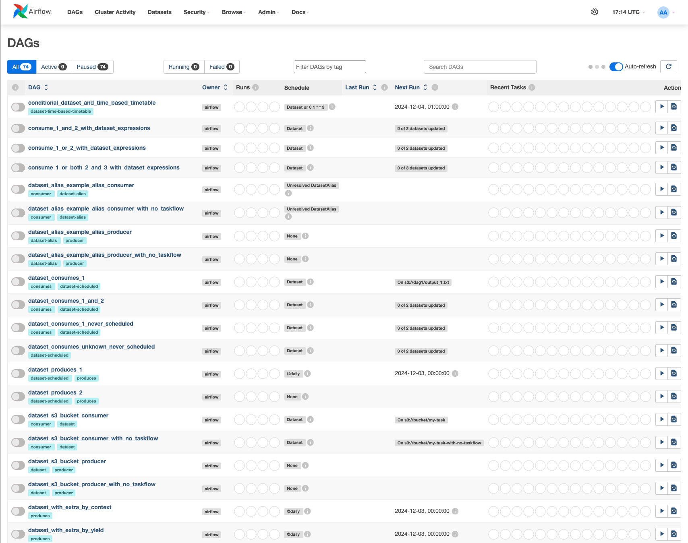
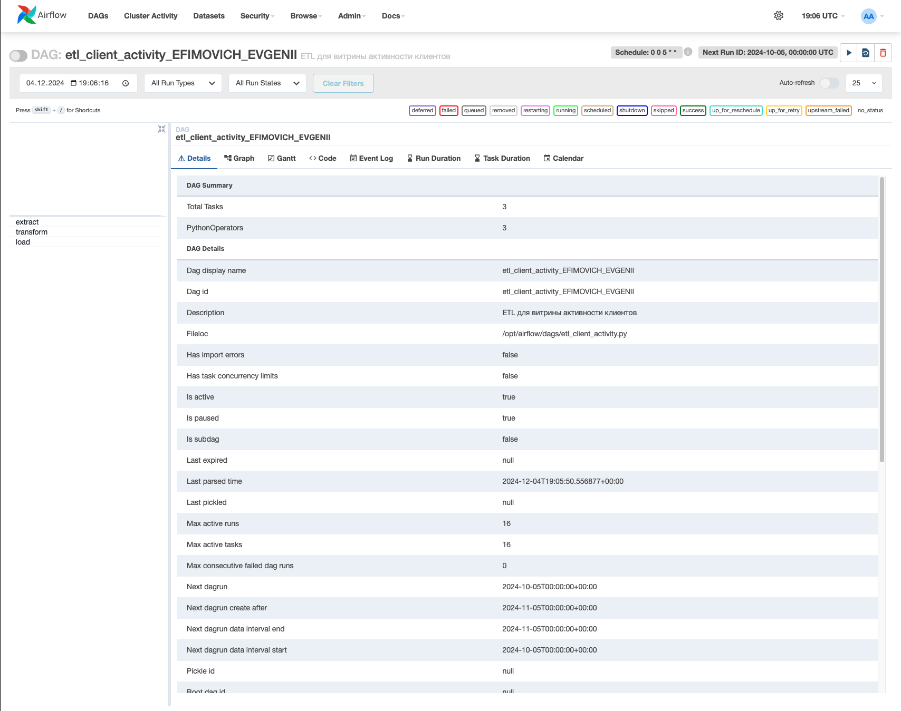
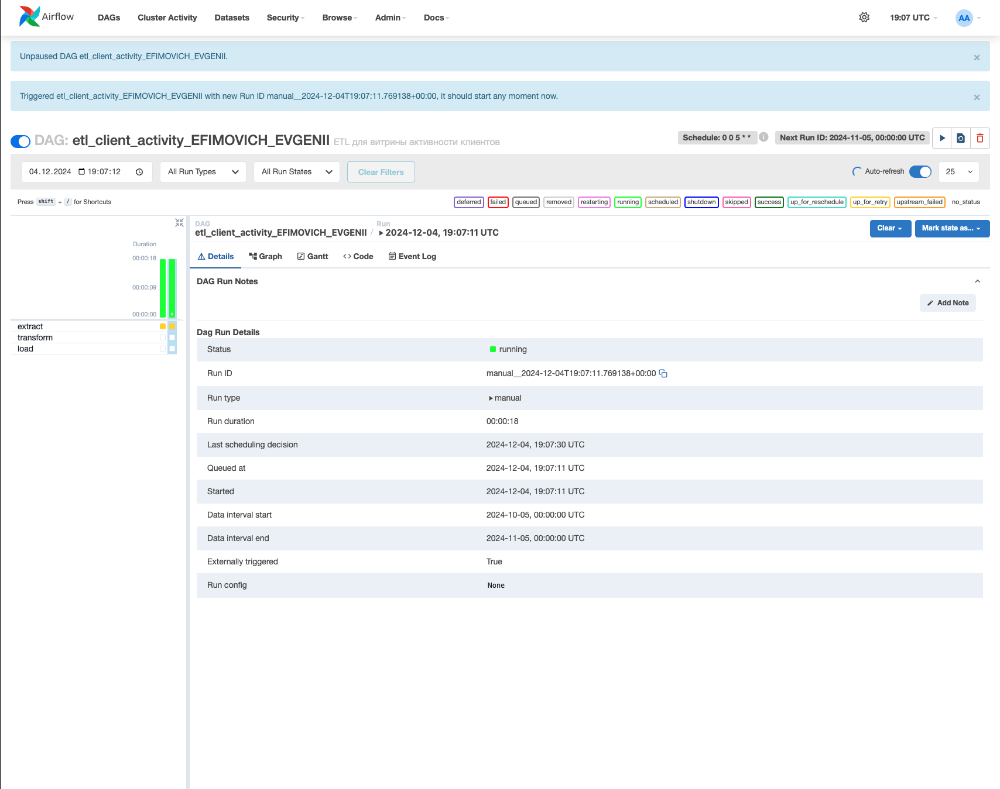
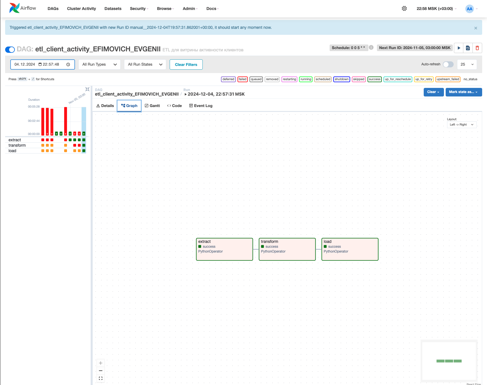
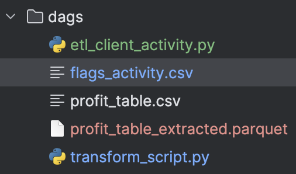
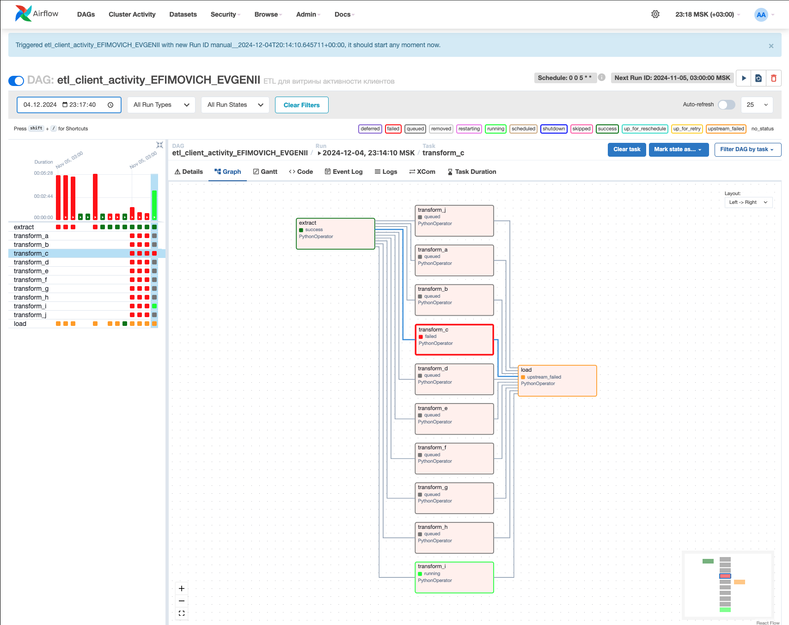

# Скринкаст выполненой работы:

1. Локальный запуск Apache Airflow:
    
2. Созданный DAG:
   
3. Запущенный DAG:
   
4. Успешное прохождение:
    
5. Результаты (побочные файлы и изменения) отработки DAG:
   
   Тут красным новый созданный DAG файл, а синий указывает на изменения в файле, DAG в итоге внес изменения в flags_activity.csv
6. Результат работы распараллеленного DAG:
   